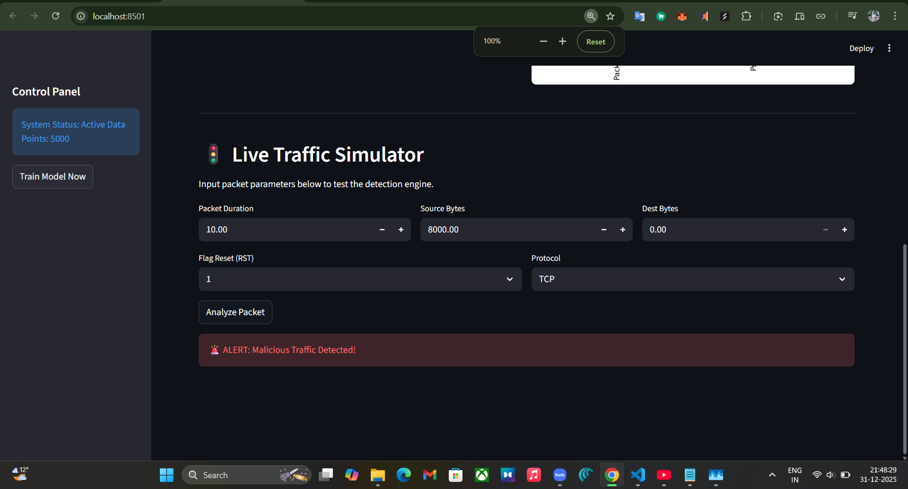

# 🛡️ AI-Based Network Intrusion Detection System (AI-NIDS)


An AI-powered dashboard that detects malicious network traffic using a **Random Forest Classifier**. This project can analyze live traffic logs or run in simulation mode.

## 📊 Dataset (Required)
This project relies on network traffic data (Wireshark logs or CIC-IDS2017). 
I have hosted the dataset on Kaggle for easy access.

👉 **[DOWNLOAD THE DATASET HERE] (https://kaggle.com/datasets/2f6c2a024a8423c27bf83f299cadc275ce3c9e032d80127a09c4b08cf8cf0442)**

### Setup Instructions:
1. Download the dataset from the link above.
2. Unzip the file (if necessary).
3. **Rename the file** to: `traffic_data.csv`
4. Place it in the root folder of this project.

---

## 🚀 How to Run Locally

### 1. Clone the Repository
```bash
git clone [https://github.com/YOUR_GITHUB_USERNAME/AI_NIDS_Project.git](https://github.com/YOUR_GITHUB_USERNAME/AI_NIDS_Project.git)
cd AI_NIDS_Project

---

### 2. The `requirements.txt`
To ensure others can run your code without errors, create (or update) a file named `requirements.txt` with these exact contents:

```text
streamlit
pandas
numpy
seaborn
matplotlib
scikit-learn

## 📸 Screenshots
| Main Dashboard | Detection Alert |
| :---: | :---: |
|  |  |
